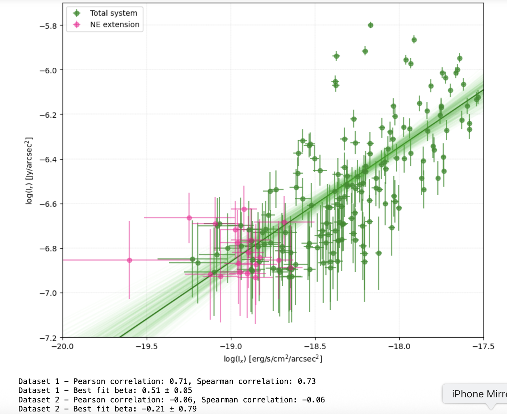

# X-ray vs Radio Correlation Analysis

This repository contains a Python-based statistical analysis of the **correlation between X-ray and radio properties** of astrophysical sources (e.g., galaxy clusters, AGN).  

The notebook demonstrates **practical applications of statistical methods** in astrophysics, including data preprocessing, correlation testing, regression, and uncertainty analysis.

---

## Key Features
- **Data preprocessing** of astrophysical datasets  
- **Correlation tests**: Pearson, Spearman, and Kendall coefficients  
- **Linear regression modeling** with uncertainty estimation  
- **Statistical visualization**: scatter plots, regression lines, residuals  

---

## Why It Matters
Correlations between X-ray and radio emission provide insights into the physical processes linking  
thermal (X-ray) and non-thermal (radio) components in astrophysical systems.  

This project showcases:
- **Domain expertise** in astrophysics  
- **Statistical analysis skills** transferable to data science  
- **Reproducible workflows** with Jupyter notebooks and Python  

---

## Tools & Libraries
- `numpy`, `scipy`, `pandas` — scientific computing  
- `matplotlib`, `seaborn` — visualization  
- `linmix` — regression and statistical tests  

---

## Example Output

Example scatter plot of X-ray vs Radio correlation with regression fit:

